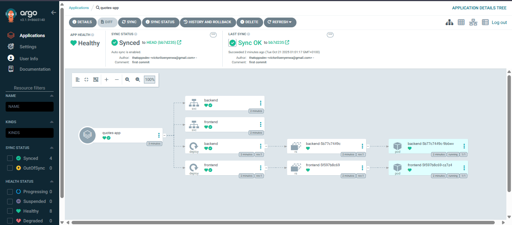
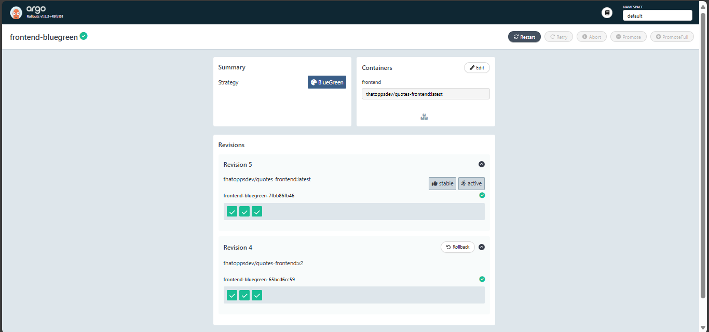
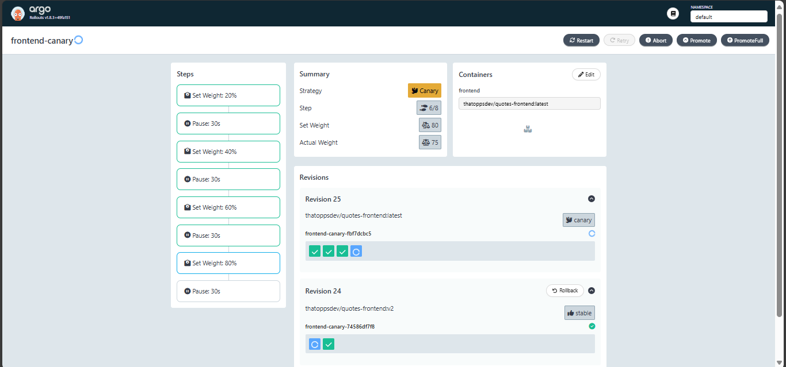
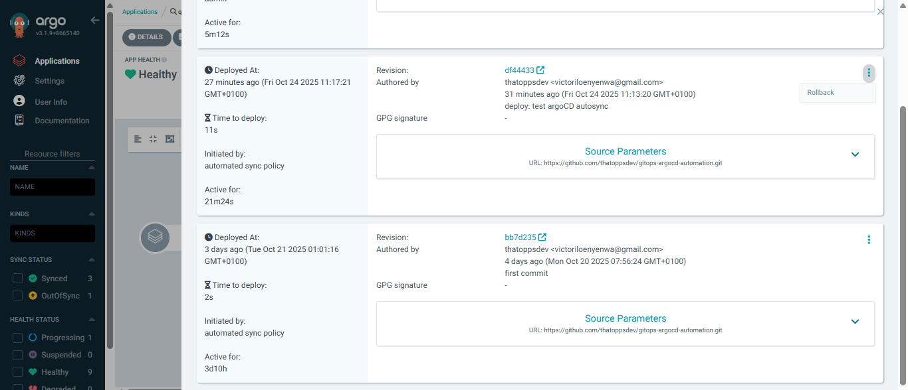

# GitOps ArgoCD Automation 🚀

A production-ready GitOps implementation demonstrating automated Kubernetes deployments using ArgoCD and Argo Rollouts, with progressive delivery strategies including Blue/Green and Canary deployments.

---

## 📋 Project Overview

This repository showcases a comprehensive GitOps workflow that automates application deployment and management on Kubernetes. The implementation emphasizes reliability, zero-downtime deployments, and declarative infrastructure management through version-controlled manifests.

### ✨ Key Features

- **Automated Continuous Delivery**: GitOps-based deployment pipeline using ArgoCD
- **Progressive Delivery**: Blue/Green and Canary deployment strategies via Argo Rollouts
- **Zero-Downtime Deployments**: Seamless version transitions without service interruption
- **Declarative Configuration**: Infrastructure and application state managed through Git
- **One-Click Rollbacks**: Quick recovery from deployment issues through ArgoCD UI

---

## 📁 Repository Structure

```
gitops-argocd-automation/
├── backend.yaml                       # Backend deployment and service configuration
├── frontend.yaml                      # Standard frontend deployment and service
├── frontend-bluegreen-rollout.yaml    # Blue/Green rollout specification
├── frontend-canary-rollout.yaml       # Canary rollout specification
├── kustomization.yaml                 # Kustomize resource management
├── README.md                          # Project documentation
└── screenshots/                       # Architecture and deployment visuals
```

---

## 🛠️ Technology Stack

| Technology | Purpose |
|------------|---------|
| **ArgoCD** | GitOps continuous delivery and deployment automation |
| **Argo Rollouts** | Progressive delivery with Blue/Green and Canary strategies |
| **Kubernetes** | Container orchestration and deployment platform |
| **Kustomize** | YAML configuration templating and management |
| **Docker Hub** | Container image registry (thatoppsdev/quotes-frontend, thatoppsdev/quotes-backend) |
| **NodePort Services** | External application access |

---

## 🔄 GitOps Workflow

The deployment pipeline follows GitOps principles with Git as the single source of truth:

1. **Declarative State**: All Kubernetes manifests are version-controlled in this repository
2. **Continuous Monitoring**: ArgoCD continuously monitors the repository for changes
3. **Automated Synchronization**: Changes to manifests or image tags trigger automatic syncs to the cluster
4. **Progressive Rollouts**: Argo Rollouts manages traffic shifting based on defined strategies
5. **Simplified Management**: Promotions and rollbacks executed through ArgoCD UI


*Complete deployment view showing application resources and health status*

---

## 🎯 Deployment Strategies

### 🔵 Blue/Green Deployment

The Blue/Green strategy maintains two complete production environments, enabling instant switchover between versions with zero downtime.

**Implementation Details:**
- Active service routes production traffic to the stable version
- Preview service exposes the new version for validation
- Traffic switches atomically upon promotion
- Instant rollback capability to previous version



### 🟡 Canary Deployment

The Canary strategy incrementally shifts traffic to new versions, allowing for risk mitigation through gradual rollout.

**Traffic Progression:**
- Initial: 20% of traffic to new version
- Step 2: 40% traffic shift
- Step 3: 60% traffic shift
- Step 4: 80% traffic shift
- Final: 100% migration upon successful validation



---

## 💡 Problem Solutions

This implementation addresses common deployment challenges:

- **Manual Deployment Elimination**: Replaced imperative kubectl commands with declarative GitOps automation
- **Zero-Downtime Deployments**: Implemented Blue/Green rollouts for seamless version transitions
- **Risk Mitigation**: Enabled gradual traffic shifting through Canary deployments with validation gates
- **Deployment Visibility**: Centralized deployment history, health monitoring, and status tracking via ArgoCD UI
- **Configuration Management**: Streamlined YAML organization and templating using Kustomize
- **Rapid Recovery**: One-click rollback functionality for quick incident response


*Version history and rollback management interface*

---

## 🚀 Getting Started

### Prerequisites

- Kubernetes cluster (v1.19+)
- ArgoCD installed and configured
- Argo Rollouts controller deployed
- kubectl CLI configured

### Deployment

1. Clone this repository
2. Configure ArgoCD to monitor this repository
3. Apply the appropriate rollout strategy (Blue/Green or Canary)
4. Monitor deployment progress through ArgoCD UI

---

## 🎓 Technical Skills Demonstrated

- Kubernetes resource management and orchestration
- GitOps methodology and best practices
- Progressive delivery patterns and traffic management
- Infrastructure as Code (IaC) principles
- Container deployment strategies
